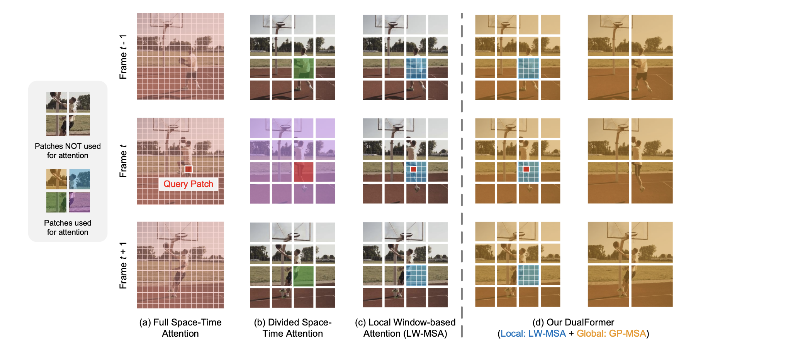
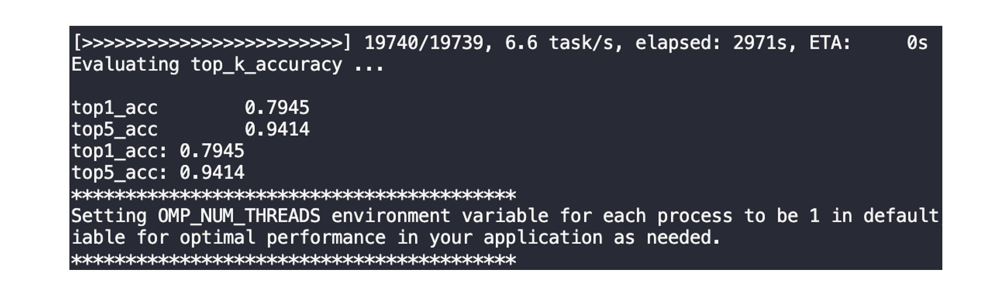
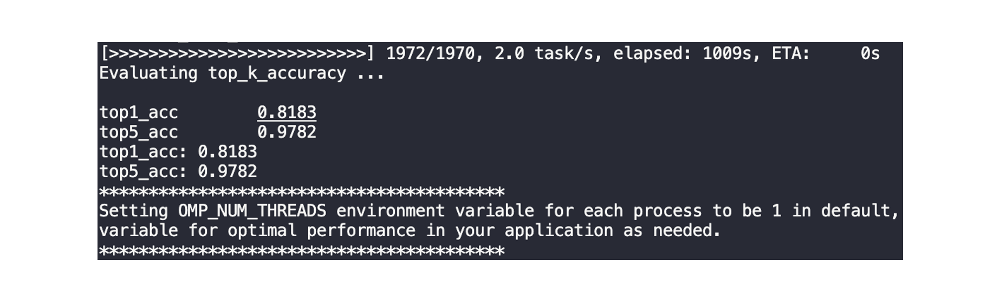
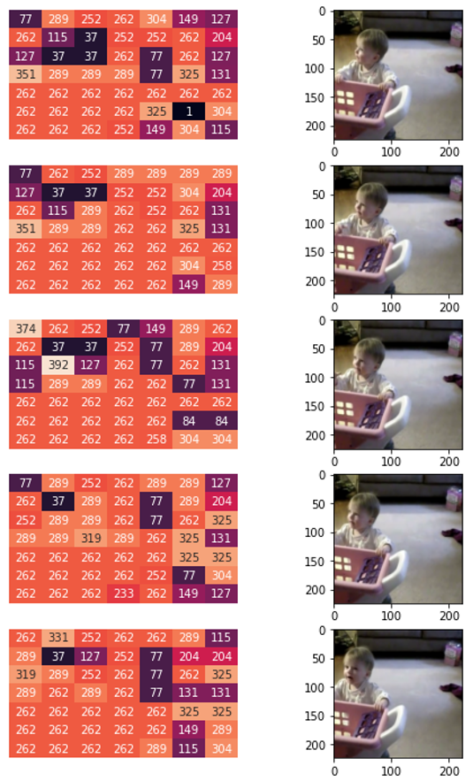
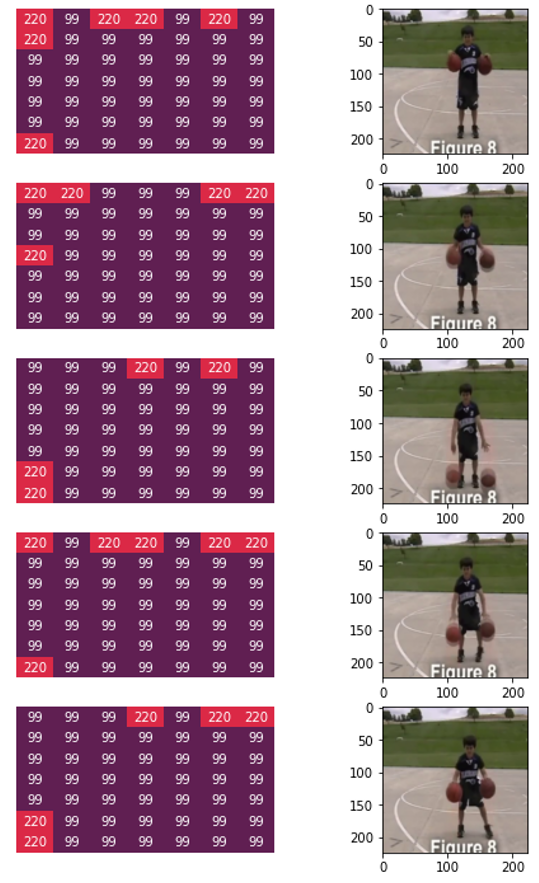

# DualFormer
This repo is the implementation of our manuscript entitled "[Local-Global Stratified Transformer for Efficient Video Recognition](https://arxiv.org/abs/2112.04674)". Our model is built on a popular video package called [mmaction2](https://github.com/open-mmlab/mmaction2). This repo also refers to the code templates provided by [PVT](https://github.com/whai362/PVT.git), [Twins](https://github.com/Meituan-AutoML/Twins) and [Swin](https://github.com/SwinTransformer/Video-Swin-Transformer). This repo is released under the [Apache 2.0 license](https://github.com/facebookresearch/fvcore/blob/main/LICENSE).

## Introduction
**DualFormer** is a Transformer architecture that can effectively and efficiently perform space-time attention for video recognition. Specifically, our DualFormer stratifies the full space-time attention into dual cascaded levels, i.e., to first learn fine-grained local space-time interactions among nearby 3D tokens, followed by the capture of coarse-grained global dependencies between the query token and the coarse-grained global pyramid contexts. Experimental results show the superiority of DualFormer on five video benchmarks against existing methods. In particular, DualFormer sets new state-of-the-art 82.9%/85.2% top-1 accuracy on Kinetics-400/600 with ∼1000G inference FLOPs which is at least 3.2× fewer than existing methods with similar performances.




##  Installation & Requirement

Please refer to [install.md](https://github.com/open-mmlab/mmaction2/blob/master/docs/en/install.md) for installation. The docker files are also provided for convenient usage - [cuda10.1](https://hub.docker.com/layers/ninja0/mmdet/pytorch1.7.1-py37-cuda10.1-openmpi-mmcv1.3.3-apex-timm/images/sha256-06d745934cb255e7fdf4fa55c47b192c81107414dfb3d0bc87481ace50faf90b?context=repo) and [cuda11.0](https://hub.docker.com/layers/ninja0/mmdet/pytorch1.7.1-py37-cuda11.0-openmpi-mmcv1.3.3-apex-timm/images/sha256-79ec3ec5796ca154a66d85c50af5fa870fcbc48357c35ee8b612519512f92828?context=repo). 

All models are trained on 8 Nvidia A100 GPUs. For example, training a DualFormer-T on Kinetics-400 takes ∼31 hours on 8 A100 GPUs, while training a larger model DualFormer-B on Kinetics-400 requires ∼3 days on 8 A100 GPUs. 

##  Data Preparation

Please first see [data_preparation.md](https://github.com/open-mmlab/mmaction2/blob/master/docs/en/data_preparation.md) for a general knowledge of data preparation.

- For **Kinetics-400/600**, as these are dynamic datasets (videos may be removed from YouTube), we employ [this repo](https://github.com/cvdfoundation/kinetics-dataset) to download the original files and the annotatoins. Only a few number of corrupted videos are removed (around 50).
- For other datasets, i.e., **HMDB-51, UCF-101 and Diving-48**, we use the data downloader provided by mmaction2 as aforementioned.

The full supported datasets are listed below (more details in [supported_datasets.md](https://github.com/open-mmlab/mmaction2/tree/master/docs/en/supported_datasets.md)):

<table style="margin-left:auto;margin-right:auto;font-size:1.3vw;padding:3px 5px;text-align:center;vertical-align:center;">
  <tr>
    <td><a href="https://github.com/open-mmlab/mmaction2/blob/master/tools/data/hmdb51/README.md">HMDB51</a> (<a href="https://serre-lab.clps.brown.edu/resource/hmdb-a-large-human-motion-database/">Homepage</a>) (ICCV'2011)</td>
    <td><a href="https://github.com/open-mmlab/mmaction2/blob/master/tools/data/ucf101/README.md">UCF101</a> (<a href="https://www.crcv.ucf.edu/research/data-sets/ucf101/">Homepage</a>) (CRCV-IR-12-01)</td>
    <td><a href="https://github.com/open-mmlab/mmaction2/blob/master/tools/data/activitynet/README.md">ActivityNet</a> (<a href="http://activity-net.org/">Homepage</a>) (CVPR'2015)</td>
    <td><a href="https://github.com/open-mmlab/mmaction2/blob/master/tools/data/kinetics/README.md">Kinetics-[400/600/700]</a> (<a href="https://deepmind.com/research/open-source/kinetics/">Homepage</a>) (CVPR'2017)</td>
  </tr>
  <tr>
    <td><a href="https://github.com/open-mmlab/mmaction2/blob/master/tools/data/sthv1/README.md">SthV1</a> (<a href="https://20bn.com/datasets/something-something/v1/">Homepage</a>) (ICCV'2017)</td>
    <td><a href="https://github.com/open-mmlab/mmaction2/blob/master/tools/data/sthv2/README.md">SthV2</a> (<a href="https://20bn.com/datasets/something-something/">Homepage</a>) (ICCV'2017)</td>
    <td><a href="https://github.com/open-mmlab/mmaction2/blob/master/tools/data/diving48/README.md">Diving48</a> (<a href="http://www.svcl.ucsd.edu/projects/resound/dataset.html">Homepage</a>) (ECCV'2018)</td>
    <td><a href="https://github.com/open-mmlab/mmaction2/blob/master/tools/data/jester/README.md">Jester</a> (<a href="https://20bn.com/datasets/jester/v1">Homepage</a>) (ICCV'2019)</td>
  </tr>
  <tr>
    <td><a href="https://github.com/open-mmlab/mmaction2/blob/master/tools/data/mit/README.md">Moments in Time</a> (<a href="http://moments.csail.mit.edu/">Homepage</a>) (TPAMI'2019)</td>
    <td><a href="https://github.com/open-mmlab/mmaction2/blob/master/tools/data/mmit/README.md">Multi-Moments in Time</a> (<a href="http://moments.csail.mit.edu/challenge_iccv_2019.html">Homepage</a>) (ArXiv'2019)</td>
    <td><a href="https://github.com/open-mmlab/mmaction2/blob/master/tools/data/hvu/README.md">HVU</a> (<a href="https://github.com/holistic-video-understanding/HVU-Dataset">Homepage</a>) (ECCV'2020)</td>
    <td><a href="https://github.com/open-mmlab/mmaction2/blob/master/tools/data/omnisource/README.md">OmniSource</a> (<a href="https://kennymckormick.github.io/omnisource/">Homepage</a>) (ECCV'2020)</td>
  </tr>
</table>

## Models
We present a major part of the model results, the configuration files, and downloading links in the following table. The FLOPs is computed by [fvcore](https://github.com/facebookresearch/fvcore), where we omit the classification head since it has low impact to the FLOPs.

| Dataset   | Version | Pretrain    | GFLOPs | Param (M) | Top-1 | Config | Download |   
|-----------|---------|-------------|--------|-----------|-----------|--------|----------|
| K400      | Tiny    | IN-1K | 240    | 21.8      | 79.5      | [link](configs/recognition/dualformer/dualformer_tiny_patch244_window877_kinetics400_1k.py)   |   [link](https://drive.google.com/file/d/1dvG6vjC7udHTwTaqmOAfn6U3HNs3T-QF/view?usp=sharing)       |   
| K400      | Small   | IN-1K | 636    | 48.9      | 80.6      | [link](configs/recognition/dualformer/dualformer_small_patch244_window877_kinetics400_1k.py)   |   [link](https://drive.google.com/file/d/1dNHPnSl39Vbh7Z-KSWYjNV3PGFlWL3TY/view?usp=sharing)       |  
| K400      | Base    | IN-1K | 1072   | 86.8      | 81.1      | [link](configs/recognition/dualformer/dualformer_base_patch244_window877_kinetics400_1k.py)   |   [link](https://drive.google.com/file/d/1U_hxRWzh92ru2efgpiFH7a0e4LCc_3m8/view?usp=sharing)       |  
| K600      | Base    | IN-22K | 1072   | 86.8      | 85.2      | [link](configs/recognition/dualformer/dualformer_base_patch244_window877_kinetics600_22k.py)   |   [link](https://drive.google.com/file/d/1bp-Bl1MVtR9Fj405mLc129dVSK-PEvSy/view?usp=sharing)   
| Diving-48 | Small   | K400        | 1908   | 48.9      | 81.8      | [link](configs/recognition/dualformer/dualformer_small_patch244_window877_diving48.py)   |   [link](https://drive.google.com/file/d/10KZbIOwBErijejv72AVJrxkngp9TU4sj/view?usp=sharing)       |   
| HMDB-51   | Small   | K400        | 1908   | 48.9      | 76.4      | [link](configs/recognition/dualformer/dualformer_small_patch244_window877_hmdb51.py)   |  [link](https://drive.google.com/file/d/1NS80zjexgQhw6UMH-bbXUsHI0ZlpPvsV/view?usp=sharing)        | 
| UCF-101   | Small   | K400        | 1908   | 48.9      | 97.5      | [link](configs/recognition/dualformer/dualformer_tiny_patch244_window877_ucf101.py)   |  [link](https://drive.google.com/file/d/1tEv2C51Z4pI2HSbb9fabsv-SIOItykDZ/view?usp=sharing)        |  


## Visualization
We visualize the attention maps at the last layer of our model generated by [Grad-CAM](https://arxiv.org/abs/1610.02391) on Kinetics-400. As shown in the following three gifs, our model successfully learns to focus on the relevant parts in the video clip. Left: flying kites. Middle: counting money. Right: walking dogs.

   


You can use the following commend to visualize the attention weights:
```
python demo/demo_gradcam.py <CONFIG_FILE> <CHECKPOINT_FILE> <VIDEO_FILE> --target-layer-name <TARGER_LAYER_NAME> --out-filename <OUTPUT_NAME>
```

For example, to visualize the last layer of DualFormer-S on a K400 video (-cii-Z0dW2E_000020_000030.mp4), please run:
```
python demo/demo_gradcam.py \
    configs/recognition/dualformer/dualformer_small_patch244_window877_kinetics400_1k.py \
    checkpoints/k400/dualformer_small_patch244_window877.pth \
    /dataset/kinetics-400/train_files/-cii-Z0dW2E_000020_000030.mp4 \
    --target-layer-name backbone/blocks/3/3 --fps 10 \
    --out-filename output/-cii-Z0dW2E_000020_000030.gif
```

## User Guide
### Folder Structure
As our implementation is based on mmaction2, we specify our contributions as follows:
- Data preparation and preprocessing are located at [base.py](mmaction/datasets/base.py) and [video_dataset.py](mmaction/datasets/video_dataset.py). You can find the data augmentation details at the [model config](configs/recognition/dualformer/dualformer_base_patch244_window877_kinetics400_1k.py).
- The source code of backbone: [click here](mmaction/models/backbones/dualformer.py).
- The source code of classification head: [click here](mmaction/models/heads/i3d_head.py).
- The training/test code [without Token Labelling](mmaction/models/recognizers/recognizer3d.py) and [with Token Labelling](mmaction/models/recognizers/recognizer3d_tl.py)


### Testing
```
# single-gpu testing
python tools/test.py <CONFIG_FILE> <CHECKPOINT_FILE> --eval top_k_accuracy

# multi-gpu testing
bash tools/dist_test.sh <CONFIG_FILE> <CHECKPOINT_FILE> <GPU_NUM> --eval top_k_accuracy
```
Example 1: to validate a `DualFormer-T` model on Kinetics-400 dataset with 8 GPUs, please run:
```
bash tools/dist_test.sh configs/recognition/dualformer/dualformer_tiny_patch244_window877_kinetics400_1k.py checkpoints/k400/dualformer_tiny_patch244_window877.pth 8 --eval top_k_accuracy
```
You will obtain the result as follows:



Example 2: to validate a `DualFormer-S` model on Diving-48 dataset with 4 GPUs, please run:
```
bash tools/dist_test.sh configs/recognition/dualformer/dualformer_small_patch244_window877_diving48.py checkpoints/diving48/dualformer_small_patch244_window877.pth 4 --eval top_k_accuracy 
```
The output will be as follows:




## Training from scratch

To train a video recognition model from scratch for Kinetics-400, please run:
```
# single-gpu training
python tools/train.py <CONFIG_FILE> [other optional arguments]

# multi-gpu training
bash tools/dist_train.sh <CONFIG_FILE> <GPU_NUM> [other optional arguments]
```
For example, to train a `DualFormer-T` model for Kinetics-400 dataset with 8 GPUs, please run:
```
bash tools/dist_train.sh ./configs/recognition/dualformer/dualformer_tiny_patch244_window877_kinetics400_1k.py 8 
```
Training a `DualFormer-S` model for Kinetics-400 dataset with 8 GPUs, please run:
```
bash tools/dist_train.sh ./configs/recognition/dualformer/dualformer_small_patch244_window877_kinetics400_1k.py 8 
```

## Training with pre-trained 2D models

To train a video recognition model with pre-trained image models, please run:
```
# single-gpu training
python tools/train.py <CONFIG_FILE> --cfg-options model.backbone.pretrained=<PRETRAIN_MODEL> [model.backbone.use_checkpoint=True] [other optional arguments]

# multi-gpu training
bash tools/dist_train.sh <CONFIG_FILE> <GPU_NUM> --cfg-options model.backbone.pretrained=<PRETRAIN_MODEL> [model.backbone.use_checkpoint=True] [other optional arguments]
```
For example, to train a `DualFormer-T` model for Kinetics-400 dataset with 8 GPUs, please run:
```
bash tools/dist_train.sh ./configs/recognition/dualformer/dualformer_tiny_patch244_window877_kinetics400_1k.py 8 --cfg-options model.backbone.pretrained=<PRETRAIN_MODEL> 
```
Training a `DualFormer-B` model for Kinetics-400 dataset with 8 GPUs, please run:
```
bash tools/dist_train.sh ./configs/recognition/dualformer/dualformer_base_patch244_window877_kinetics400_1k.py 8 --cfg-options model.backbone.pretrained=<PRETRAIN_MODEL> 
```
**Note:** `use_checkpoint` is used to save GPU memory. Please refer to [this page](https://pytorch.org/docs/stable/checkpoint.html) for more details.

## Training with Token Labelling

We also present the first attempt to improve the video recognition model by generalizing [Token Labelling](https://arxiv.org/abs/2104.10858) to videos as additional augmentations, in which MixToken is turned off as it does not work on our video datasets. For instance, to train a small version of DualFormer using DualFormer-B as the annotation model on the fly, please run:
```
bash tools/dist_train.sh configs/recognition/dualformer/dualformer_tiny_tokenlabel_patch244_window877_kinetics400_1k.py 8 --cfg-options model.backbone.pretrained='checkpoints/pretrained_2d/dualformer_tiny.pth' --validate 
```
Notice that we place the checkpoint of the annotation model at 'checkpoints/k400/dualformer_base_patch244_window877.pth'. You can change it to anywhere you want, or modify the path variable in [this file](mmaction/models/backbones/dualformer.py).

We present two examples of visualization of token labelling on video data. For simiplicity, we omit several frames and thus each example only shows 5 frames with uniform sampling rate. For each frame, each value p(i,j) on the left hand side means the pseudo label (index) at each patch of the last stage provided by the annotation model.

- Visualization example 1 (Correct label: pushing cart, index: 262).
- Visualization example 2 (Correct label: dribbling basketball, index: 99).

&nbsp;&nbsp;&nbsp;&nbsp;&nbsp;&nbsp;&nbsp;&nbsp;&nbsp;&nbsp;&nbsp;&nbsp;&nbsp;&nbsp;



### Apex (optional):
We use apex for mixed precision training by default. To install apex, use our provided docker or run:
```
git clone https://github.com/NVIDIA/apex
cd apex
pip install -v --disable-pip-version-check --no-cache-dir --global-option="--cpp_ext" --global-option="--cuda_ext" ./
```
If you would like to disable apex, comment out the following code block in the [configuration files](configs/recognition/dualformer):
```
# do not use mmcv version fp16
fp16 = None
optimizer_config = dict(
    type="DistOptimizerHook",
    update_interval=1,
    grad_clip=None,
    coalesce=True,
    bucket_size_mb=-1,
    use_fp16=True,
)
```

## Citation
If you find our work useful in your research, please cite:
```
@article{liang2021dualformer,
         title={DualFormer: Local-Global Stratified Transformer for Efficient Video Recognition}, 
         author={Yuxuan Liang and Pan Zhou and Roger Zimmermann and Shuicheng Yan},
         year={2021},
         journal={arXiv preprint arXiv:2112.04674},
}
```

## Acknowledgement
We would like to thank the authors of the following helpful codebases:

- [Video Swin Transformer](https://github.com/SwinTransformer/Video-Swin-Transformer) for video recognition.
- [Swin Transformer](https://github.com/microsoft/Swin-Transformer): the best paper award at ICCV 2021.
- [Twins-SVT](https://github.com/Meituan-AutoML/Twins) for image processing.
- [Pyramid Vision Transformer](https://github.com/whai362/PVT.git) for image processing. 

Please kindly consider star these related packages as well. Thank you much for your attention.


